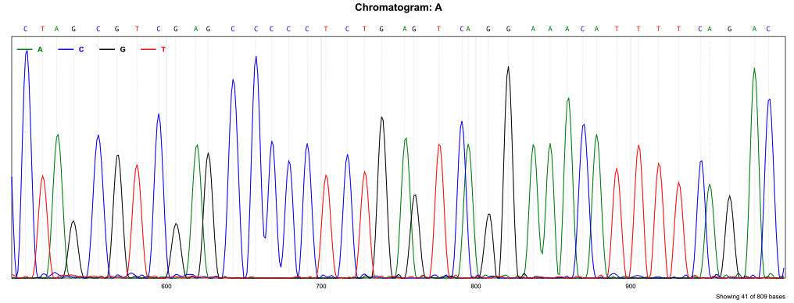

# ABIF Parser for Nim

[](https://github.com/quadram-institute-bioscience/nim-abif/actions/workflows/test.yaml)
[](https://bioconda.github.io/recipes/nim-abif/README.html)
[](https://bioconda.github.io/recipes/nim-abif/README.html)


A Nim library to parse [ABIF](chromatograms.md) (Applied Biosystems Information Format)
files from DNA sequencing machines, commonly used in Sanger capillary sequencing.

- [**API reference**](https://quadram-institute-bioscience.github.io/nim-abif/)

 

## Installation

To install the CLI packages:

```bash 
conda install -c bioconda nim-abif
```

If you have Nim installed, you can install binaries and library with:
```
nimble install abif
```

## Usage

### Basic Usage

```nim
import abif

# Parse a trace file
let trace = newABIFTrace("path/to/trace.ab1")

# Get sequence and quality information
let sequence = trace.getSequence()
let qualityValues = trace.getQualityValues()
let sampleName = trace.getSampleName()

# Export sequence to FASTA format
trace.exportFasta("output.fa")

# Export sequence to FASTQ format
trace.exportFastq("output.fq")

# Don't forget to close the trace when done
trace.close()
```

### Accessing Raw Data

```nim
# Get all tag names in the file
let tagNames = trace.getTagNames()

# Access data for a specific tag
let data = trace.getData("PBAS2")  # Base calls
let rawData = trace.getData("DATA1")  # Raw channel data
```

### Command-line Usage

The library provides three command-line tools:

 

#### FASTQ converter with quality trimming

```
abi2fq trace.ab1 output.fq
```

The abi2fq tool provides quality-based sequence trimming:

```
abi2fq --help                    # Show help message
abi2fq --window=15 --quality=25 trace.ab1  # Trim with window size 15, quality threshold 25
abi2fq --no-trim trace.ab1       # Skip quality trimming
abi2fq --verbose trace.ab1       # Show additional information
abi2fq trace.ab1                 # Output to STDOUT
```

#### Merging paired (forward/reverse) traces

```
abimerge forward.ab1 reverse.ab1 merged.fq
```

The abimerge tool combines forward and reverse Sanger reads using Smith-Waterman alignment:

```
abimerge --help                          # Show help message
abimerge --min-overlap=30 fwd.ab1 rev.ab1 # Require at least 30bp overlap
abimerge --score-match=10 --score-mismatch=-8 --score-gap=-10 fwd.ab1 rev.ab1  # Custom alignment scores
abimerge --join=10 fwd.ab1 rev.ab1       # Join seqs with 10 Ns if no overlap found
abimerge --pct-id=90 fwd.ab1 rev.ab1     # Require 90% identity in overlap region
abimerge --verbose fwd.ab1 rev.ab1       # Show alignment details
```

#### Render traces

Convert a trace (or part of it) into SVG



```bash
abichromatogram tests/A_forward.ab1 -o A.svg -s 500 -e 1000 --width 1600
```

#### Batch hotspot mutation screening

Screen many traces against a panel of hotspot mutations, producing CSV, VCF, and an interactive HTML report with per-call chromatogram evidence.

```
abiscreen -i traces/ -p targets.tsv -r refs.fa -o results/
```

Files are aligned against the reference panel (orientation auto-detected) and the state at each hotspot position is classified as Reference, Variant, Heterozygous, Ambiguous, or FailedQC.

```
abiscreen --help                                     # Show help message
abiscreen -i traces/ -p targets.tsv -r refs.fa -o results/                # Default: emit CSV, VCF, and HTML
abiscreen --report csv,vcf -i traces/ -p targets.tsv -r refs.fa -o out/   # Emit only CSV and VCF
abiscreen --min-q 20 --min-identity 0.65 -i traces/ -p targets.tsv -r refs.fa -o out/  # Custom QC thresholds
abiscreen --threads 4 -i traces/ -p targets.tsv -r refs.fa -o out/        # Limit worker threads
```

## Data Types

The ABIF format supports various data types, all of which are properly handled by this parser:

- Numeric types (byte, word, short, long, float, double)
- String types (char, pString, cString)
- Date and time values
- Boolean values

## Development

### Running Tests

```
nimble test
```

### Building Documentation

```
nimble docs
```

## License

This library is licensed under the MIT License - see the [LICENSE](LICENSE) file for details.

## Acknowledgments

This Nim implementation is based on:
- Co-authored with [Claude code](CLAUDE.md)
- Inspired by Python implementation: [abifpy](https://github.com/bow/abifpy) and a Perl implementation: [Bio::Trace::ABIF](https://metacpan.org/pod/Bio::Trace::ABIF) from CPAN

